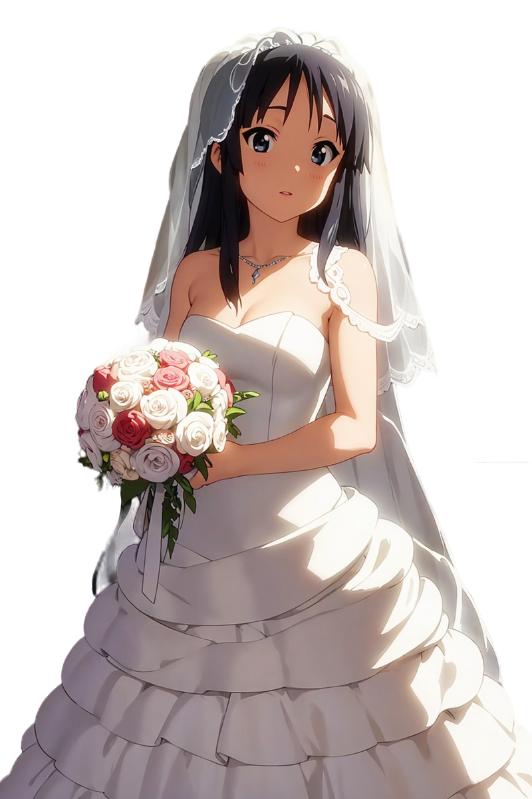

# Akiyama Mio — 秋山 澪:

    <picture>
        <source 
        srcset="assets/AkiyamaMio.png"
        media="(prefers-color-scheme: dark)"
        />
        <source
        srcset="assets/AkiyamaMio.png"
        media="(prefers-color-scheme: light), (prefers-color-scheme: no-preference)"
        />
        
    </picture>

 

> Welcome to the Akiyama Mio Model

## Overview
It's foolish to say this because I haven't trained Mio yet for financial reasons, but Mio is NLP model capable of generating anime lyrics.

The base model used is <a href='https://huggingface.co/lightblue/karasu-1.1B'>lightblue/karasu-1.1B</a> it is well trained on Japanese language data. The database used is <a href='https://huggingface.co/datasets/v3xlrm1nOwo1/AnimeSongsLyrics'>v3xlrm1nOwo1/AnimeSongsLyrics</a> I collected and cleaned this data myself It contains 23 thousand anime songs and related information and it is available in an account on huggingface <a href="https://huggingface.co/v3xlrm1nOwo1/">v3xlrm1nOwo1</a>. and in mio training I use 400 number of episodes with learning rate 3e-6. this model would be great if you could train it

## Acknowledgments
A special thanks to all the talented artists and creators behind these anime songs, making this dataset a melodic treasure trove.

## License

This Model is provided under the [Apache License 2.0](LICENSE). Feel free to use, modify, and share it.

# ToDo List
- [x] Creat Dataset.
- [x] Creat Model.
- [ ] Training The Model.
- [ ] Upload Model To huggingface.

> **_NOTE:_**  To contribute to the project, please contribute directly. I am happy to do so, and if you have any comments, advice, job opportunities, or want me to contribute to a project, please contact me I am happy to do so <a href='mailto:v3xlrm1nOwo1@gmail.com' target='blank'>v3xlrm1nOwo1@gmail.com</a>

